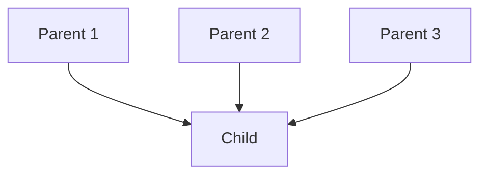
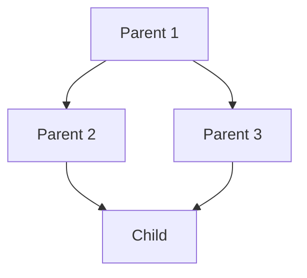

# Multi-inheritance Mechanism in Python

## Example 1

When a class is derived from `more than one base class` it is called multiple Inheritance. The _`derived class`_ inherits `all the features` of the base case.



```python
class Parent_1:
    def here(self):
        print("I am a parent 1 ")

class Parent_2:
    def here(self):
        print("I am a parent 2 ")

class Parent_3:
    def here(self):
        print("I am a parent 3 ")

class Child(Parent_1, Parent_2, Parent_3):
    pass

child_1 =Child()

child_1.here() 
```

### output-1

```plaintext
I am a parent 1 

```

## Example 2



```python

class Parent_1:
    def here(self):
        print("I am a parent 1 ")

class Parent_2(Parent_1):
    def here(self):
        print("I am a parent 2 ")

class Parent_3(Parent_1):
    def here(self):
        print("I am a parent 3 ")

class Child(Parent_2, Parent_3):
    pass

child_1 =Child()

child_1.here() 
```

### output-2

```plaintext
I am a parent 2 
```

> Here The child call the first parent if it found the instance method execute it. if not it goes to the next parent and so on to find the instance method and execute it.
